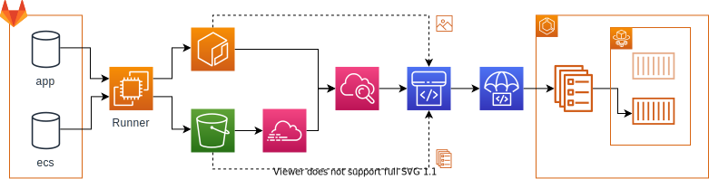

# レポジトリの説明

GitLab + ECS CICDパイプラインを構築するTerraformモジュール群とそのセットアップ方法を格納したレポジトリです。GitLabに作成するレポジトリのサンプルも格納しています。本レポジトリで作成するAWS環境およびCICDの全体像は以下の通りです。また、GitLab CICDを動かすサンプルのレポジトリも用意しています。

**AWS環境図**

**CICDフロー図**

# バージョン

本レポジトリのモジュール群は以下のバージョンを前提としてます。（構築時のバージョンも記載します。）

terraform 0.13.2 以上　（構築時 0.13.3）
aws providor 3.5.0以上　

# ドキュメント

モジュールや使い方などのドキュメントは以下になります。

- [モジュール説明](./documents/module.md)
- [CICDフロー説明](./documents/cicd.md)
- [使い方](./documents/howtouse.md)