# レポジトリの説明

GitLab + ECS CICDパイプラインを構築するTerraformモジュール群とそのセットアップ方法を格納したレポジトリです。GitLabに作成するレポジトリのサンプルも格納しています。本レポジトリで作成するCICDの全体像は以下の通りです。

[!CICDフロー図](./documents/images/cicd.drawio)

# バージョン

本レポジトリのモジュール群は以下のバージョンを前提としてます。（構築時のバージョンも記載します。）

terraform 0.13.2 以上　（構築時 0.13.3）
aws providor 3.5.0以上　
