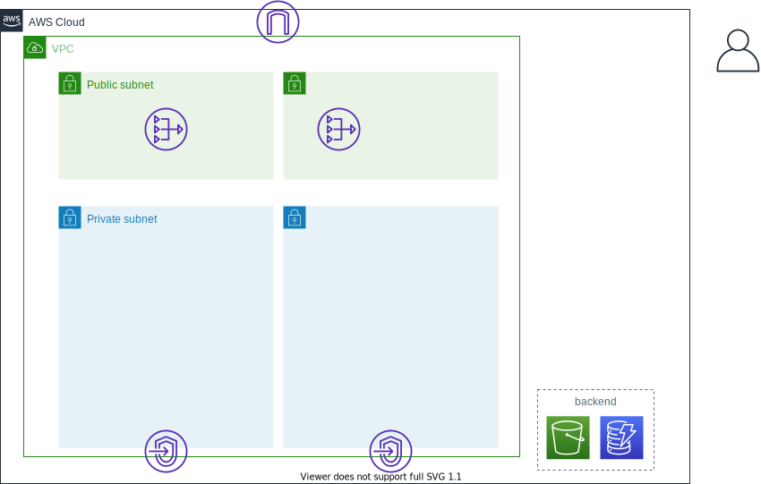
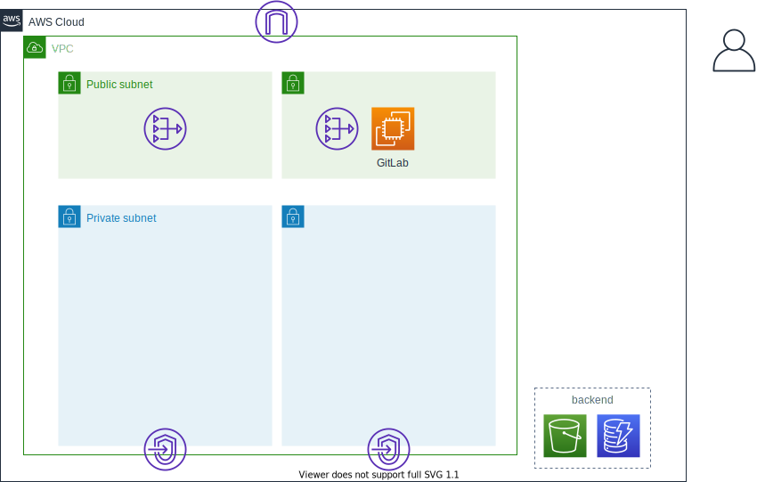
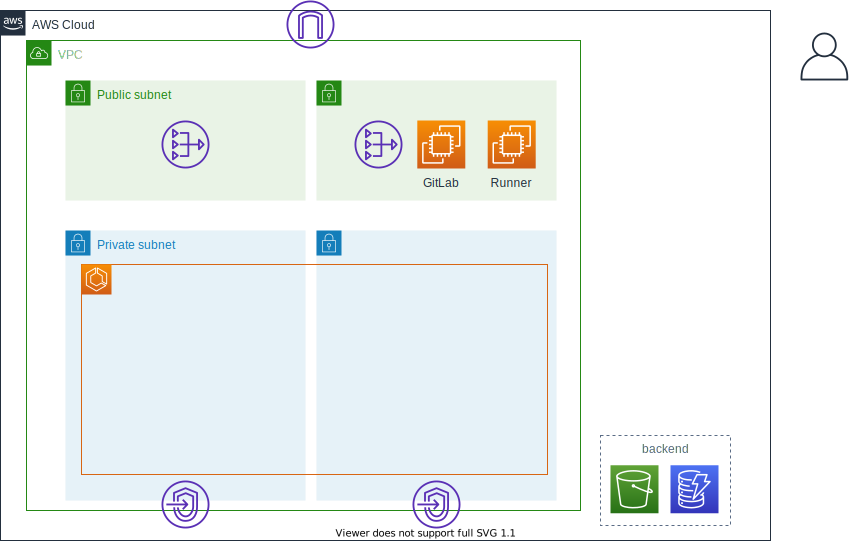
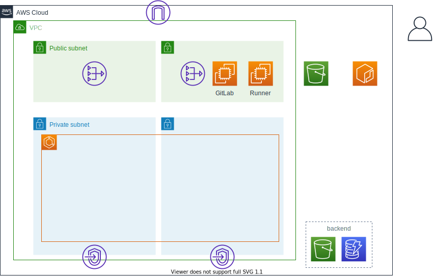

- [使い方](#使い方)
  - [環境構築](#環境構築)
    - [ネットワーク](#ネットワーク)
    - [GitLabサーバ](#gitlabサーバ)
    - [GitLab Runner](#gitlab-runner)
    - [ECSクラスタ](#ecsクラスタ)
  - [サービス構築](#サービス構築)
    - [事前準備](#事前準備)
    - [GitLab CICDによるソース配置](#gitlab-cicdによるソース配置)
    - [サービスデプロイ](#サービスデプロイ)
  - [サービスの更新](#サービスの更新)
    - [アプリケーションの更新](#アプリケーションの更新)
    - [ECS設定の更新](#ecs設定の更新)
  - [サービスの追加](#サービスの追加)
  - [環境削除](#環境削除)

# 使い方

以下の順番で各モジュールを実行します。環境構築の`ネットワーク`および`GitLabサーバ`は自身の環境に合わせて実行要否を判断してください。サービス構築の`GitLab CICDによるソース配置`はTerraformモジュールの実行ではなく、GitLabのレポジトリに対する作業になります。サービス構築はサービスごとに実行してください。

- 環境構築
  - ネットワーク（任意）
  - GitLabサーバ（任意）
  - GitLab Runner
  - ECSクラスタ
- サービス構築
  - 事前準備
  - GitLab CICDによるソース配置
  - サービスデプロイ

まずは本レポジトリを任意の場所でクローンしてください。なお、以降の手順では任意のディレクトリのパスを`$CLONEDIR`環境変数として進めます。

``` sh
export CLONEDIR=`pwd`
git clone https://github.com/moriryota62/ecs-cicd-gitlab.git
```

## 環境構築

環境構築はプロジェクトで一度だけ行います。環境の分け方によっては複数実施するかもしれません。`main-template`ディレクトリをコピーして`環境名`ディレクトリなどの作成がオススメです。以下の手順では`cicd-dev`という環境名を想定して記載します。

``` sh
cd $CLONEDIR/ecs-cicd-gitlab/terraform
export PJNAME=cicd-dev
cp -r main-template $PJNAME
```

また、すべてのモジュールで共通して設定する`PJ-NAME`、`REGION`、`OWNER`の値はsedで置換しておくと後の手順が楽です。regionは他の手順でも使用するので環境変数にしておきます。以下の手順では`us-east-2`を設定します。

**Linuxの場合**

``` sh
cd $PJNAME
export REGION=us-east-2
find ./ -type f -exec grep -l 'REGION' {} \; | xargs sed -i -e 's:REGION:'$REGION':g'
find ./ -type f -exec grep -l 'PJ-NAME' {} \; | xargs sed -i -e 's:PJ-NAME:'$PJNAME':g'
find ./ -type f -exec grep -l 'OWNER' {} \; | xargs sed -i -e 's:OWNER:nobody:g'
```

**macの場合**

``` sh
cd $PJNAME
export REGION=us-east-2
find ./ -type f -exec grep -l 'REGION' {} \; | xargs sed -i "" -e 's:REGION:'$REGION':g'
find ./ -type f -exec grep -l 'PJ-NAME' {} \; | xargs sed -i "" -e 's:PJ-NAME:'$PJNAME':g'
find ./ -type f -exec grep -l 'OWNER' {} \; | xargs sed -i "" -e 's:OWNER:nobody:g'
```

### ネットワーク

すでにVPCやサブネットがある場合、ネットワークのモジュールは実行しなくても良いです。その場合はVPCとサブネットのIDを確認しておいてください。ネットワークモジュールでVPCやサブネットを作成する場合は以下の手順で作成します。

ネットワークモジュールのディレクトリへ移動します。

``` sh
cd $CLONEDIR/ecs-cicd-gitlab/terraform/$PJNAME/environment/network
```

`network.tf`を編集します。`locals`配下のパラメータを修正します。VPCやサブネットのCIDRは自身の環境にあわせて任意のアドレス帯に修正してください。

修正したら以下コマンドでモジュールを作成します。

``` sh
terraform init
terraform apply
> yes
```

実行後に出力される`vpc_id`や`public_subent_ids`などは後続のモジュールで使用します。

``` sh
export VPCID=<vpc_id>
export PUBLICSUBNET1=<public_subent_ids 1>
export PUBLICSUBNET2=<public_subent_ids 2>
export PRIVATESUBNET1=<private_subent_ids 1>
export PRIVATESUBNET2=<private_subent_ids 2>
```

**作成後のイメージ**



### GitLabサーバ

インターネットのSaaS版GitLabを使用する場合、GitLabサーバのモジュールは実行しなくても良いです。SaaS版でもグループの作成やRunnerトークンの確認は実施してください。

GitLabサーバモジュールのディレクトリへ移動します。

``` sh
cd $CLONEDIR/ecs-cicd-gitlab/terraform/$PJNAME/environment/self-host-gitlab
```

`self-host-gitlab.tf`を編集します。`region`と`locals`配下のパラメータを修正します。とくにvpc_idとsubnet_id（パブリックサブネットのID）、SGのインバウンドCIDRは自身の環境にあわせて変更してください。また、自動スケジュールや自動スナップショットを有効にする場合、対応する機能を`true`に設定してください。

``` sh
export YOURACCESSCIDR=<cidr>
```

**Linuxの場合**

``` sh
sed -i -e 's:VPC-ID:'$VPCID':g' self-host-gitlab.tf
sed -i -e 's:PUBLIC-SUBNET-1:'$PUBLICSUBNET1':g' self-host-gitlab.tf
sed -i -e 's:YOURCIDR:'$YOURACCESSCIDR':g' self-host-gitlab.tf
```

**macの場合**

``` sh
sed -i "" -e 's:VPC-ID:'$VPCID':g' self-host-gitlab.tf
sed -i "" -e 's:PUBLIC-SUBNET-1:'$PUBLICSUBNET1':g' self-host-gitlab.tf
sed -i "" -e 's:YOURCIDR:'$YOURACCESSCIDR':g' self-host-gitlab.tf
```

修正したら以下コマンドでモジュールを作成します。

``` sh
terraform init
terraform apply
> yes
```

表示される`public_dns`、`public_ip`、`runner_sg_id`はどこかに控えておいてください。

terraform実行後、以下の通りGitLabサーバにアクセスしてGitLabサーバの準備をしてください。

- GitLabサーバを構築したら許可した端末からGUIに接続します。ブラウザにEC2インスタンスのパブリックIPまたはパブリックDNSを入力してください。terraform完了後、つながらくしても繋がらない場合、インスタンスを再起動してみるとよいかもしれません。

- 初回アクセスの場合、rootのパスワード変更を求められるため、パスワードを設定してください

- rootのパスワードを入力するとログイン画面が表示されます。先ほど設定したパスワードでrootにログインします

- 上部メニューバーの[Admin Area（スパナマーク）]を選択します

- 左メニューから[Settings]-[General]-[Visibility and access controls]を開き`Custom Git clone URL for HTTP(S)`にEC2インスタンスのパブリックDNS名を`http://`をつけて入力し[Save changes]します。（デフォルトではAWSの外部で名前解決できない名前になっているためです。名前解決できる名前ならプラベートDNS名以外の任意のドメイン名でも構いません。）

- 左メニューから[Overview]-[Users]を開き`New user`を選択します。任意のユーザを作成してください。（パスワードはユーザ作成後、ユーザの一覧画面でeditすると設定できる。）

- 左メニューから[Overview]-[Groups]を開き`New group`を選択します。任意の名前のグループを作成してください。また、上記作成したユーザをグループのownerに設定してください

- 一度rootからログアウトし、上記ユーザでログインしなおしてください。（初回ログインの場合パスワード変更が求められます。任意のパスワードに変更してください）

- 上部メニューバーの[Groups]-[Your groups]を表示し、先ほど作成したグループを選択します

- グループの画面で左メニューから[Settings]-[CICD]-[Runners]を開きます。`Set up a group Runner manually`のURLとトークンを確認します。たとえば以下のような値となっているはずです

1. http://ec2-3-138-55-5.us-east-2.compute.amazonaws.com/
2. 972hz6YiJTWUcN4ECUNk

**作成後のイメージ**



### GitLab Runner

GitLab Runnerサーバモジュールのディレクトリへ移動します。

``` sh
cd $CLONEDIR/ecs-cicd-gitlab/terraform/$PJNAME/environment/gitlab-runner
```

`gitlab-runner.tf`を編集します。`region`と`locals`配下のパラメータを修正します。とくにvpc_idとsubnet_id（パブリックサブネットのID）は自身の環境に合わせて修正してください。ec2_gitlab_urlとec2_registration_tokenも`GitLabサーバ`モジュールで確認した値に必ず修正してください。SaaS版GitLabの場合、urlは`https://gitlab.com`になります。`ec2_sg_id`はセフルホストの場合、GitLabサーバモジュールのoutputで表示された`runner_sg_id`を設定してください。SaaS版GitLabの場合は`空文字`で設定してください。自動スケジュールを有効にする場合、対応する機能を`true`に設定してください。

**Linuxの場合**

``` sh
sed -i -e 's:VPC-ID:'$VPCID':g' gitlab-runner.tf
sed -i -e 's:PUBLIC-SUBNET-1:'$PUBLICSUBNET1':g' gitlab-runner.tf
# ↓sedで置換する時、http:の`:`の前にエスケープを入れてください。例 https\://gitlab.com
sed -i -e 's:GITLAB-URL:<先ほどGitLabで確認したURL>:g' gitlab-runner.tf 
sed -i -e 's:REGIST-TOKEN:<先ほどGitLabで確認したregistraton_token>:g' gitlab-runner.tf
# ↓セフルホストの場合はSG ID ,SaaSの場合は次のように空で設定(s:RUNNER-SG-ID::g)
sed -i -e 's:RUNNER-SG-ID:<GitLab RunnerのSG>:g' gitlab-runner.tf
```

**macの場合**

``` sh
sed -i "" -e 's:VPC-ID:'$VPCID':g' gitlab-runner.tf
sed -i "" -e 's:PUBLIC-SUBNET-1:'$PUBLICSUBNET1':g' gitlab-runner.tf
# ↓sedで置換する時、http:の`:`の前にエスケープを入れてください。例 https\://gitlab.com
sed -i "" -e 's:GITLAB-URL:<先ほどGitLabで確認したURL>:g' gitlab-runner.tf
sed -i "" -e 's:REGIST-TOKEN:<先ほどGitLabで確認したregistraton_token>:g' gitlab-runner.tf
# ↓セフルホストの場合はSG ID ,SaaSの場合は次のように空で設定(s:RUNNER-SG-ID::g)
sed -i "" -e 's:RUNNER-SG-ID:<GitLab RunnerのSG>:g' gitlab-runner.tf
```

修正したら以下コマンドでモジュールを作成します。

``` sh
terraform init
terraform apply
> yes
```

上記実行が完了したらGitLab側にRunnerが認識されているか確認します。

- グループに所存したユーザでGitLabにログインしてください

- グループの画面で左メニューから[Settings]-[CICD]-[Runners]を開きます。`Available Runners`に作成したRunnerが表示されていれば登録完了です。表示されるまでには少し時間がかかります

**作成後のイメージ**


### ECSクラスタ

ECSクラスタモジュールのディレクトリへ移動します。

``` sh
cd $CLONEDIR/ecs-cicd-gitlab/terraform/$PJNAME/environment/ecs-cluster
```

`ecs-cluster.tf`を編集します。`region`と`locals`配下のパラメータを修正します。（今までの置換コマンドを実行している場合はとくに不要です。）

修正したら以下コマンドでモジュールを作成します。

``` sh
terraform init
terraform apply
> yes
```

**作成後のイメージ**



## サービス構築

サービスの構築はサービスごとに行います。terraformのコードもサービスごとに作成するため、あらかじめ用意された`service-template`ディレクトリをコピーし、`サービス名`ディレクトリなどの作成がオススメです。以下の手順では`test-app`というサービス名を想定して記載します。

``` sh
cd $CLONEDIR/ecs-cicd-gitlab/terraform/$PJNAME/
export APPNAME=test-app
cp -r service-template $APPNAME
```

また、すべてのモジュールで共通して設定する`pj`、`app`、`vpc_id`の値はsedで置換しておくと後の手順が楽です。なお、ここで設定するpjの値は環境構築モジュールで設定したpjと同じ値にしてください。

**Linuxの場合**

``` sh
cd $APPNAME
find ./ -type f -exec grep -l 'APP-NAME' {} \; | xargs sed -i -e 's:APP-NAME:'$APPNAME':g'
find ./ -type f -exec grep -l 'VPC-ID' {} \; | xargs sed -i -e 's:VPC-ID:'$VPCID':g'
```

**macの場合**

``` sh
cd $APPNAME
find ./ -type f -exec grep -l 'APP-NAME' {} \; | xargs sed -i "" -e 's:APP-NAME:'$APPNAME':g'
find ./ -type f -exec grep -l 'VPC-ID' {} \; | xargs sed -i "" -e 's:VPC-ID:'$VPCID':g'
```

### 事前準備

事前準備モジュールのディレクトリへ移動します。

``` sh
cd $CLONEDIR/ecs-cicd-gitlab/terraform/$PJNAME/$APPNAME/preparation
```

`preparation.tf`を編集します。`region`と`locals`配下のパラメータを修正します。（今までの置換コマンドを実行している場合はとくに不要です。）

修正したら以下コマンドでモジュールを作成します。

``` sh
terraform init
terraform apply
> yes
```

outputに出力されるsg_idはService用に作成したセキュリティーグループのIDです。この後の手順で使用します。

``` sh
export SGID=<sg_id>
```

**作成後のイメージ**



### GitLab CICDによるソース配置

これはterraformを実行する手順ではありません。GitLabで実施する手順になります。現在AWS側にはアプリケーションのコンテナイメージとECSのデプロイ設定を配置する場所が用意できています。例で作成した`cicd-dev`プロジェクトの`test-app`アプリケーションの場合、それぞれ以下の通りです。

|対象データ|配置サービス|配置場所|
|-|-|-|
|アプリケーションのコンテナイメージ|ECR|`cicd-dev-test-app`レポジトリ|
|ECSのデプロイ設定|S3|`cicd-dev-test-app`バケット|

上記配置場所に対象データを格納しないとこの後に実行する`サービスデプロイ`モジュールが上手く動きません。GitLab CICDを動かすための環境も準備できているため、GitLab CICDによりGitLabのレポジトリにプッシュすれば自動で配置場所に対象データを格納できるようにしましょう。サンプルとなるレポジトリを`sample-repos`ディレクトリ配下に用意しています。これらのサンプルを参考に以下の様にGitLab側の設定を行います。なお、サンプルディレクトリ配下のファイルを使う場合、以下のように置換を行ってください。

**Linuxの場合**

``` sh
cd $CLONEDIR/ecs-cicd-gitlab
cp -r sample-repos $APPNAME
cd $APPNAME
find ./ -type f -exec grep -l 'REGION' {} \; | xargs sed -i -e 's:REGION:<自身が使用しているリージョン>:g'
find ./ -type f -exec grep -l 'AWS-ID' {} \; | xargs sed -i -e 's:AWS-ID:<自身が使用しているAWSアカウントのID>:g'
find ./ -type f -exec grep -l 'PJ-NAME' {} \; | xargs sed -i -e 's:PJ-NAME:'$PJNAME':g'
find ./ -type f -exec grep -l 'APP-NAME' {} \; | xargs sed -i -e 's:APP-NAME:'$APPNAME':g'
find ./ -type f -exec grep -l 'SG-ID' {} \; | xargs sed -i -e 's:SG-ID:'$SGID':g'
find ./ -type f -exec grep -l 'PRIVATE-SUBNET-1' {} \; | xargs sed -i -e 's:PRIVATE-SUBNET-1:'$PRIVATESUBNET1':g'
find ./ -type f -exec grep -l 'PRIVATE-SUBNET-2' {} \; | xargs sed -i -e 's:PRIVATE-SUBNET-2:'$PRIVATESUBNET2':g'
```

**macの場合**

``` sh
cd $CLONEDIR/ecs-cicd-gitlab
cp -r sample-repos $APPNAME
cd $APPNAME
find ./ -type f -exec grep -l 'REGION' {} \; | xargs sed -i "" -e 's:REGION:'$REGION':g'
find ./ -type f -exec grep -l 'AWS-ID' {} \; | xargs sed -i "" -e 's:AWS-ID:<自身が使用しているAWSアカウントのID>:g'
find ./ -type f -exec grep -l 'PJ-NAME' {} \; | xargs sed -i "" -e 's:PJ-NAME:'$PJNAME':g'
find ./ -type f -exec grep -l 'APP-NAME' {} \; | xargs sed -i "" -e 's:APP-NAME:'$APPNAME':g'
find ./ -type f -exec grep -l 'SG-ID' {} \; | xargs sed -i "" -e 's:SG-ID:'$SGID':g'
find ./ -type f -exec grep -l 'PRIVATE-SUBNET-1' {} \; | xargs sed -i "" -e 's:PRIVATE-SUBNET-1:'$PRIVATESUBNET1':g'
find ./ -type f -exec grep -l 'PRIVATE-SUBNET-2' {} \; | xargs sed -i "" -e 's:PRIVATE-SUBNET-2:'$PRIVATESUBNET2':g'
```

- グループに所存したユーザでGitLabにログインしてください

- 上部メニューバーの[Groups]-[Your groups]を表示し、先ほど作成したグループを選択します

- グループの画面で`new project`で新しくプロジェクト（レポジトリ）を作成します。サンプルの例だと`app`と`ecs`という名前の2つのレポジトリを作成します。このとき、個別ユーザのプロジェクトではなく、グループ配下のプロジェクトとして作成してください。そうしないとRunnerが使えません。

- `app`レポジトリにはアプリケーションのソースとDockerfileを配置するため以下のコマンドを実行します。レポジトリのルートに`.gitlab-ci.yml`を配置します。サンプルだとファイル名の頭に`.`を入れていないためリネームを行っておいます。この`.gitlab-ci.yml`はGitLab CICDのパイプライン設定になります。このファイルに記述した内容をGitLab Runnerサーバで実行します。`tags`で指定した値はどのGitLab Runnerを使用するか判別するためのものです。プロジェクト用に作成したGitLab Runnerを指定するためプロジェクト名を指定しています。

  ``` sh
  cd $CLONEDIR
  git clone <appレポジトリのクローンURL>
  # クローン時にID/パスワードが求められたら先ほどGitLabで作成したユーザでログイン
  cd app
  cp -r $CLONEDIR/ecs-cicd-gitlab/$APPNAME/app/* ./
  mv gitlab-ci.yml ./.gitlab-ci.yml
  git add .
  git commit -m "init"
  git push
  ```

- `ecs`レポジトリにはCodeDeployによるECS Serviceデプロイをするための設定ファイルを配置するため以下のコマンドを実行します。`app`レポジトリ同様、レポジトリのルートに`.gitlab-ci.yml`を配置し、対象runnerのタグをプロジェクト名にします。

  ``` sh
  cd $CLONEDIR
  git clone <ecsレポジトリのクローンURL>
  # クローン時にID/パスワードが求められたら先ほどGitLabで作成したユーザでログイン
  cd ecs
  cp -r $CLONEDIR/ecs-cicd-gitlab/$APPNAME/ecs/* ./
  mv gitlab-ci.yml ./.gitlab-ci.yml
  git add .
  git commit -m "init"
  git push
  ```

- `.gitlab-ci.yml`があるレポジトリをmasterにプッシュするとGitLab CICDによりパイプラインが実行されます。`app`レポジトリでは「docker build」を行い指定したECRへプッシュします。`ecs`レポジトリでは設定ファイル群をzipファイルに圧縮し指定したS3バケットへcpします。パイプラインの実行状態は各レポジトリの左メニュー[CICD]-[パイプライン]で状況を確認できます

- 上手く実行できればECRおよびS3にデータが格納でてきるはずなので確認してください

### サービスデプロイ

サービスデプロイモジュールのディレクトリへ移動します。

``` sh
cd $CLONEDIR/ecs-cicd-gitlab/terraform/$PJNAME/$APPNAME/service-deploy
```

`source.tf`を編集します。`region`と`locals`配下のパラメータを修正します。とくにvpc_idとsubnet_idは自身の環境に合わせて修正してください。

**Linuxの場合**

``` sh
sed -i -e 's:PRIVATE-SUBNET-1:'$PRIVATESUBNET1':g' service-deploy.tf
sed -i -e 's:PRIVATE-SUBNET-2:'$PRIVATESUBNET2':g' service-deploy.tf
sed -i -e 's:PUBLIC-SUBNET-1:'$PUBLICSUBNET1':g' service-deploy.tf
sed -i -e 's:PUBLIC-SUBNET-2:'$PUBLICSUBNET2':g' service-deploy.tf
sed -i -e 's:SERVICESGID:'$SGID':g' service-deploy.tf
```

**macの場合**

``` sh
sed -i "" -e 's:PRIVATE-SUBNET-1:'$PRIVATESUBNET1':g' service-deploy.tf
sed -i "" -e 's:PRIVATE-SUBNET-2:'$PRIVATESUBNET2':g' service-deploy.tf
sed -i "" -e 's:PUBLIC-SUBNET-1:'$PUBLICSUBNET1':g' service-deploy.tf
sed -i "" -e 's:PUBLIC-SUBNET-2:'$PUBLICSUBNET2':g' service-deploy.tf
sed -i "" -e 's:SERVICESGID:'$SGID':g' service-deploy.tf
```

修正したら以下コマンドでモジュールを作成します。

``` sh
terraform init
terraform apply
> yes
```

実行後に出力される`dns_name`はLBのDNS名です。コピーしてWEBブラウザでアクセスします。すべて上手く行けば以下のようなメッセージの画面が表示されます。なお、デプロイはterraform完了からさらに数分の時間を要します。デプロイ失敗なのか待ちなのか確認するには、マネジメントコンソールでcodepipelineの画面を開き現在の状況を追ってみるとよいでしょう。Deployが進行中であればまだしばらく待ったください。

**出力メッセージ**

``` 
これはCICDでデプロイされたアプリケーション
test-app です。
```

**作成後のイメージ**


## サービスの更新

### アプリケーションの更新

アプリケーションを更新して変更をGitLabにプッシュします。CICDにより自動で新しいアプリケーションがデプロイされることを確認します。

`app`レポジトリに移動します。

``` sh
cd $CLONEDIR/app
```

`index.js`を修正します。以下の例では`これはCICDでデプロイされたアプリケーション`という文章を`ソースレポジトリが更新されると自動でデプロイされるアプリケーション`に置換しています。

**Linuxの場合**

``` sh
sed -i -e 's:これはCICDでデプロイされたアプリケーション:ソースレポジトリが更新されると自動でデプロイされるアプリケーション:g' index.js
```

**macの場合**

``` sh
sed -i "" -e 's:これはCICDでデプロイされたアプリケーション:ソースレポジトリが更新されると自動でデプロイされるアプリケーション:g' index.js
```

変更をGitLabにプッシュします。

``` sh
git add .
git commit -m "update text"
git push
```

数分してからサービス（LB）のDNS名でアクセスしてみてください。先ほどまでとは画面の表示が変わるはずです。なお、アクセスしても画面が同じ場合、まだパイプラインの途中であることが考えられます。GitLab CICDまたはCodePipeline、Deployの状況を確認してみてください。

### ECS設定の更新

ECSの設定を更新して変更をGitLabにプッシュします。CICDにより自動で新しいアプリケーションがデプロイされることを確認します。

`ecs`レポジトリに移動します。

``` sh
cd $CLONEDIR/ecs
```

`taskdef.json`を修正します。以下の例ではコンテナに付与する環境変数`appname`の値を`$APP-NMAE`->`cicd test update`に置換しています。

**Linuxの場合**

``` sh
sed -i -e 's:\: "'$APPNAME'":\: "cicd test update":g' taskdef.json
```

**macの場合**

``` sh
sed -i "" -e 's:\: "'$APPNAME'":\: "cicd test update":g' taskdef.json
```

変更をGitLabにプッシュします。

``` sh
git add .
git commit -m "update env"
git push
```

しばらくしてからサービス（LB）のDNS名でアクセスしてみてください。先ほどまでとは画面の表示が変わるはずです。なお、アクセスしても画面が同じ場合、まだパイプラインの途中であることが考えられます。GitLab CICDまたはCodePipeline、Deployの状況を確認してみてください。

## サービスの追加

サービスを追加したい場合、[サービス構築](#サービス構築)の手順を繰り返します。この時、APPNAMEは必ず変えるようにしてください。

## 環境削除

構築したときの逆の以下モジュール順に`terraform destroy`を実行してください。

1. サービスデプロイ
2. 事前準備
3. ECSクラスタ
4. GitLab Runner
5. GitLabサーバ
6. ネットワーク
